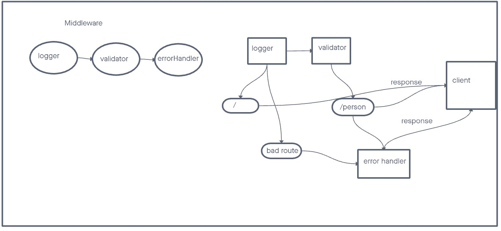

# LAB - Class 02

## Project: server-deployment-practice

## Author: Kaeden O'Meara

## Problem Domain

Express Server Mechanics: Routing, Middleware, and Approaches to Testing

## Links and Resources

- [GitHub Actions](https://github.com/KaedenOC/basic-express-server/actions)

- [back-end prod server](https://basic-express-server-u3wy.onrender.com)

## Collaborators

Referenced from in class demo as well as worked with Ike and Josh Coffey (for a bit).

## Setup

.env requirements (where applicable)
port variable exists within the env sample.

How to initialize/run your application (where applicable)

clone repo, npm i, then run nodemon in the terminal

## Routes

GET : /person?name= - specific route to hit

## Tests

to run tests, after running npm i, run the command npm test

## UML

